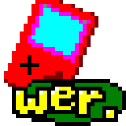

# wer



A Game Boy, Super Game Boy and Game Boy Color emulator written in
[C3](https://c3-lang.org), with SDL3 for video, sound and input.

It aims at accuracy: the CPU, timer, PPU and APU are modelled at the level
the common hardware test suites check; results below.

## Features

- **Models**: Game Boy (DMG), Super Game Boy and Super Game Boy 2, Game Boy
  Color. CGB-only games switch to the Game Boy Color automatically.
- **Super Game Boy**: game-controlled colours and borders, the 32 built-in
  palettes, the original SGB running about 2.4% fast like the real one.
- **Game Boy Color**: colour games, double speed, VRAM DMA, and original Game
  Boy games coloured the way a Game Boy Color does it (palettes picked from
  the title, or with a button combination during the boot logo).
- **Pixel-by-pixel PPU**: register changes in the middle of a line show up
  where they happen.
- **Cartridges**: MBC1 (including multicarts), MBC2, MBC3 with the real-time
  clock, MBC5; battery saves (`.sav`, with the RTC in the format other
  emulators use).
- **Own boot ROMs** for the DMG and the CGB, with the WER logo (sources in
  `bootrom/`); no Nintendo code. `--no-boot` starts games directly instead.
- **Save states** (9 slots per game), **pause**, **frame advance** and
  **fast forward**.
- **Gamepads** (any SDL3 gamepad), **key remapping**, **window scale** 1x-4x,
  a menu, a file dialog to open ROMs, and settings kept in `~/.wer/wer.conf`.

## Test results

| Suite | Result |
|---|---|
| [Mooneye Test Suite](https://github.com/Gekkio/mooneye-test-suite) | 105/105 (every test for DMG, SGB, SGB2 and CGB) |
| [Mealybug Tearoom](https://github.com/mattcurrie/mealybug-tearoom-tests) | DMG 24/24, CGB 27/27 |
| [dmg-acid2](https://github.com/mattcurrie/dmg-acid2), [cgb-acid2](https://github.com/mattcurrie/cgb-acid2) | pixel-exact |
| Blargg `cpu_instrs`, `instr_timing`, `mem_timing`, `mem_timing-2`, `halt_bug`, `interrupt_time` | pass |
| Blargg `dmg_sound`, `cgb_sound` | 12/12, 12/12 |
| Blargg `oam_bug` | 7/8 (`7-timing_effect` writes past its own text buffer, on SameBoy too) |
| [SameSuite](https://github.com/LIJI32/SameSuite) | 65/78 (the rest target specific CGB revisions, or give SameBoy's results) |
| [Gambatte test suite](https://github.com/pokemon-speedrunning/gambatte-core) | 5123/5225 (98%) |
| [rtc3test](https://github.com/aaaaaa123456789/rtc3test), [MBC3 Tester](https://github.com/EricKirschenmann/MBC3-Tester-gb) | pass |
| [SingleStepTests sm83](https://github.com/SingleStepTests/sm83) | every case, including bus timing |

## Building

Needs [c3c](https://github.com/c3lang/c3c) 0.8.x and SDL 3.2 or newer.

```sh
c3c build -O2        # build/wer
```

Prebuilt Linux x86-64 binaries are on the
[releases page](https://github.com/8lall0/wer/releases).

## Running

```sh
wer game.gb                 # or start without a ROM and open one from the menu
wer --mode=cgb game.gbc
```

| Option | |
|---|---|
| `--mode=dmg\|sgb\|sgb2\|cgb` | the model to emulate |
| `--palette=1-A` … `4-H` | SGB built-in palette (SGB modes) |
| `--scale=1..4` | window size, multiples of 160x144 |
| `--no-boot` | skip the boot ROM |
| `--sgb-log` | print the commands an SGB game sends |
| `--headless --frames=N` | no window: run N frames, write the last one to `wer-frame.ppm` |

Options given on the command line override `~/.wer/wer.conf` for that run.

### Controls

| | Keyboard | Gamepad |
|---|---|---|
| D-pad | arrow keys | d-pad or left stick |
| A / B | Z / X | right / bottom face button |
| Start / Select | Enter / Right Shift | Start / Back |
| Menu | Esc | Guide, or Back + Start |
| Open ROM | Ctrl+O | |
| Save state 1-9 | Shift+F1 … Shift+F9 | Menu |
| Load state 1-9 | F1 … F9 | Menu |
| Pause | P | |
| Frame advance | N | |
| Fast forward | hold Tab | |

Every Game Boy button can be rebound, to a key or a gamepad button, in
**Menu → Controls**; a hotkey whose key is bound to a Game Boy button gives
way to it. The menu also switches the model, SGB palette and scale; changes
are saved to `~/.wer/wer.conf`.

Save states are stored next to the ROM (`game.gb.ss1` … `game.gb.ss9`, beside
the battery save `game.gb.sav`). A state belongs to the game, the model and
the build of wer that wrote it; another version of wer refuses to load it.

## Tests

```sh
scripts/fetch-mooneye.sh      # and fetch-mealybug.sh, fetch-acid2.sh,
scripts/fetch-blargg.sh       #     fetch-sm83-tests.sh, fetch-samesuite.sh,
                              #     fetch-gambatte.sh
c3c test
./build/testrun --test-nocapture --test-filter mooneye   # a suite's report
WER_GAMBATTE=1 c3c test -O2 --test-nocapture --test-filter gambatte
```

The test ROM suites run on all CPU cores (`WER_THREADS=n` to change that;
`c3c test -O2` is about four times faster than the default unoptimized
build). The Gambatte suite runs only when asked (thousands of ROMs, under a
minute optimized); its passing checks are recorded in `test/gambatte_pass.txt`.

The test ROMs are not in the repository; each fetch script downloads its
suite into `test/` (SameSuite is built from source and needs RGBDS). Without
them, those tests pass with a note.

## Boot ROMs

`bootrom/` holds the sources of wer's DMG and CGB boot ROMs (RGBDS);
`scripts/build-bootroms.sh` rebuilds them into `src/bootrom*.c3`. The CGB one's
compatibility palettes come from Pan Docs and The Cutting Room Floor's notes
on the Game Boy Color boot ROM.

## Development

Wer began as a hand-written project. Since then it has been developed together
with [Claude Code](https://claude.com/claude-code), which wrote the test
harnesses and a large part of the emulator (among others the pixel-by-pixel
PPU, Game Boy Color support, the APU accuracy work and the boot ROMs), under
the author's direction and review.

## License

[MIT](LICENSE).

The sound (`src/apu/`) is a port of [SameBoy](https://github.com/LIJI32/SameBoy)'s
APU and the pixel renderer follows SameBoy's; those parts also carry
SameBoy's MIT licence ([LICENSE-sameboy](LICENSE-sameboy)).
